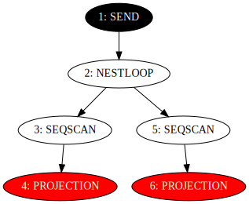
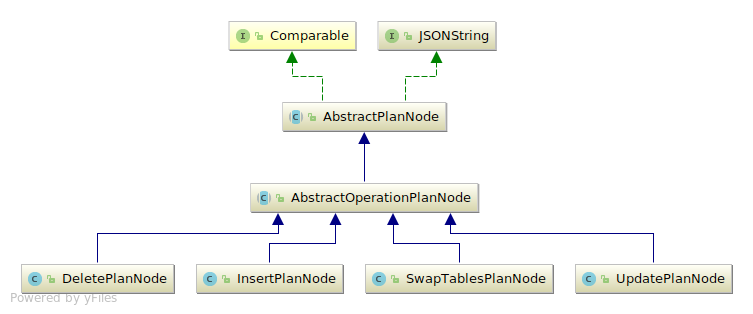
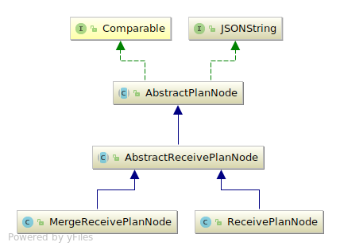
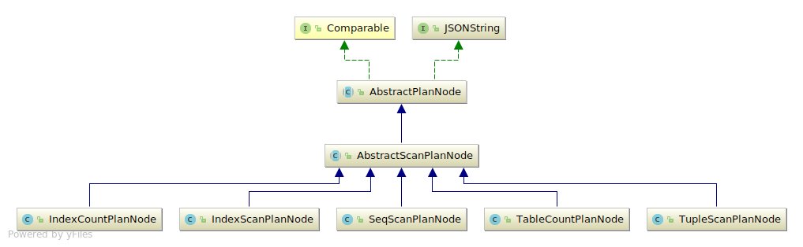
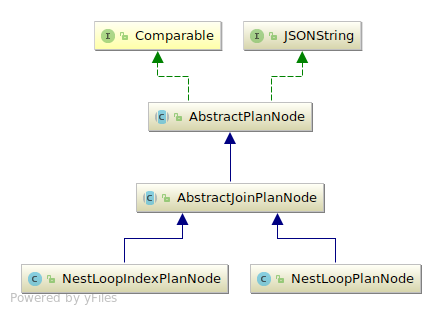
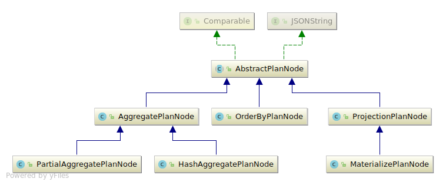
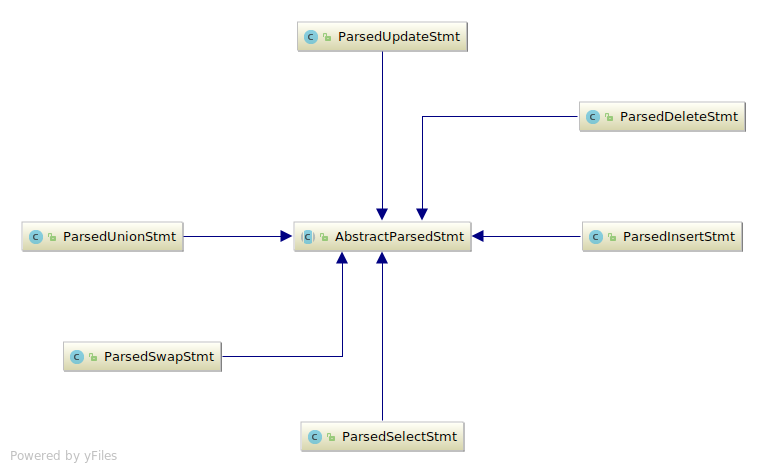

<!-- .slide: data-state="no-toc-progress" --> <!-- don't show toc progress bar on this slide -->

## VOLTDB SQL COMPILATION
<!-- .element: class="no-toc-progress" --> <!-- slide not in toc progress bar -->

### How To Turn Queries Into Plans.

created by [bill.white@voltdb.com](https://github.com/VoltDB) | 2018-05-22 | [online][1] | [src][2]

***Note:*** Use the question mark key (?) for navigation help.

[1]: https://griggsresearchinstitute.github.io/VoltDBSQLCompilation
[2]: https://github.com/BillWhite/VoltDBSQLCompilation

----  ----

## SQL. SQL Query Syntax.
* Here we give a very short *reprise* of SQL query syntax, just to 
  fix terminology.
* Tables and indexes are straightforward.
* Select statements have interesting structure.

Notes:
* Before we begin, we need to set the stage.
* This is to fix terminology only.

----

## SQL.1. A *Reprise* of SQL Query Syntax
Consider this query:

```
        select max(t1.a * t2.a)              <-- display list
            from r1 as t1 join r1 as t2      <-- range variables
                on t1.a < 0 and t1.a = t2.a  <-- join conditions
            where t1.a < 100                 <-- where condition
            group by t1.a, t2.a              <-- group by expressions
            having sum(t1.a) > 0             <-- having condition
            order by t1.a                    <-- order by expression
            offset 10                        <-- offset
            limit 100;                       <-- limit
```

Notes:
* We call the display list the select list sometimes.
* Andrew calls it the *selection list*.
* Range variables *have* tables but they *are not* tables.
* *Where* conditions and *join conditions* are similar.  They
  filter out rows.
* We call *range variables* *tablescans*.

----  ----

## A SQL query plan is basically a nested loop.
* For this SQL:

```SQL
select * from  outerTable as O join innerTable as I 
    on O.id = I.id;
```

  The execution is a variant of this pseudo code:

```Java
for (Row outerRow : getRows(outerTable)) {
    for (Row innerRow : getRows(innerTable)) {
        if (outerRow.id == innerRow.id) { // <-- filter
            outputRow(concat(outerRow, innerRow))
        }
    }
}
```

----

## Everything else is an optimization.
* We may scan an index rather than a table.
* We may filter the rows on one table alone, or on both.
* We may swap the outer and inner tables.

Notes:
* The names 'inner' and 'outer' are used frequently in this sense.
* Don't confuse 'inner tables' and 'outer tables' with 'inner joins'
  and 'outer joins'.

----  ----

## Plans. Execution Plans
* Before we describe the planner we have to explain what the desired output would be.
* Look at the JavaDoc comment for the package:
      org.voltdb.planner
  for much more detail than we can give in this presentation.

----  ----

## Plans.1 An Example.
This `SQL` query: 

      select * from r join s on r.id = s.id;

Produces this plan tree (read from bottom to top),



Notes:
* Compare programs to processes.
    * Programs are disk files.
    * Processes have an execution stack, a proc table entry, file descriptors etc.
* Plans are like programs.
* ExecutorVectors are like processes.
* Ignore the red nodes.  They are inline, and are special.

----

<!-- .slide: data-background-image="img/plan.svg" --> <!-- Change the scary background -->
<!-- .slide: data-background-size="20%" --> <!-- Change the scary background -->
<!-- .slide: data-background-position="top 100% right 100%" --> <!-- Change the scary background -->

## Plans.1.a. `SEQSCAN` Nodes.
* The White nodes are sequential scan nodes.
* The output will be the the rows of the input table, but
  processed through the Red projection nodes.

Notes:
* The Red nodes should really be inside the `SEQSCAN` ellipses.

----

<!-- .slide: data-background-image="img/plan.svg" --> <!-- Change the scary background -->
<!-- .slide: data-background-size="20%" --> <!-- Change the scary background -->
<!-- .slide: data-background-position="top 100% right 100%" --> <!-- Change the scary background -->

## Plans.1.b. `PROJECTION` Nodes.
* The Red nodes are projection nodes, which select columns.
* They can also compute expressions.
* These are red in this diagram, which denotes inline nodes.
* As the `SEQSCAN` nodes read rows from the tables they filter them
  through the `PROJECTION` nodes before sending the rows to the
  `SEQSCAN` node's output table.

----

<!-- .slide: data-background-image="img/plan.svg" -->  <!-- Change the scary background -->
<!-- .slide: data-background-size="20%" --> <!-- Change the scary background -->
<!-- .slide: data-background-position="top 100% right 100%" --> <!-- Change the scary background -->

## Plans.1.c. `NESTLOOP` Nodes.
* The `NESTLOOP` nodes compute all pairs `<r1, r2>` from r and s.
* The join condition `r.id = s.id` is computed here, and rows are
  filtered out.

----

<!-- .slide: data-background-image="img/plan.svg" -->  <!-- Change the scary background -->
<!-- .slide: data-background-size="20%" --> <!-- Change the scary background -->
<!-- .slide: data-background-position="top 100% right 100%" --> <!-- Change the scary background -->

## Plans.1.d. `SEND` Nodes.
* The `SEND` node packages up the table in a format which
  can be sent back to the server.

Notes:
* More detail on how to make this diagram on the next slide.

----

<!-- .slide: data-background-image="img/plan.svg" -->  <!-- Change the scary background -->
<!-- .slide: data-background-size="20%" --> <!-- Change the scary background -->
<!-- .slide: data-background-position="top 100% right 100%" --> <!-- Change the scary background -->

## Plans.1.e. How to make this diagram.
* In a shell window,
    * run `export VOLTDB_OPTS="-Dorg.voltdb.compilerdebug=true"`
    * Start a voltdb server *in this shell window*.
* In another window,
    * Run sqlcmd.
    * Define the tables `r` and `s`.
    * Run the sql query.  No data is really needed for this.

----

<!-- .slide: data-background-image="img/plan.svg" -->  <!-- Change the scary background -->
<!-- .slide: data-background-size="20%" --> <!-- Change the scary background -->
<!-- .slide: data-background-position="top 100% right 100%" --> <!-- Change the scary background -->

## Plans.1.f. How to view the diagram.
* In the directory in which the server is running, look for the 
  directory named `debugoutput/statement-all-plans` there will be
  a file named `WINNER-0.dot`.  Hunt around for it.
* Process this file with the `graphviz` tool `dot`, like this:
    * `dot -Tsvg -o plan.svg WINNER-0.dot`
* View the SVG file `plan.svg` with some tool, like chrome.
* Use `-Tpdf` or `-Tps` for other formats if you don't like SVG.

----

<!-- .slide: data-background-image="img/plan.svg" -->  <!-- Change the scary background -->
<!-- .slide: data-background-size="20%" --> <!-- Change the scary background -->
<!-- .slide: data-background-position="top 100% right 100%" --> <!-- Change the scary background -->

## Plans.1.g. `debugoutput`.
There are many other files in `debugoutput` which are interesting.
* The actual JSON text for the plan is there someplace.
* HSQLDB's notion of the catalog schema is in `schema-xml/hsql-catalog-output.xml`.
* The printed representation of the abstract parsed statement for the
  query is there somewhere.
* Explore!!  Go Wild!!

----  ----

## Phases.1. The main phases.

* Statement Splitting
* VoltCompiler
* HSQL
    * Output 1: Catalog and HSQLDB State Changes
    * Output 2: `VoltXMLElement` objects.
* `QueryPlanner`
    * Output: Execution plans.

Notes:
* `HSQLDB` state is its own catalog.
* The actual flow of control is not shown here.
* We will discuss `VoltXMLElement` in more detail below.

----  ----

## Phases.1.1. Data Flow


Notes:
* Note that `HSQLDB` shows up twice here.
    * Once is for DDL.
    * Once is for DML/DQL.
* `HSQLDB` doesn't know about `CREATE FUNCTION FROM METHOD...`, but it
  needs to know the function being defined and its signature.
* This diagram is more evocative than accurate.

----

## Phases.2. A debugging tip.

* The method
      org.hsqldb_voltpatches.HSQLInterface.getXMLCompiledStatement
  transforms a SQL statement string into a `VoltXMLElement` object.  
* `VoltXMLElement` is one of the several intermediate forms we use.  More on this later.
* A breakpoint in `getXMLCompiledStatement` often leads to enlightenment.

----

## Phases.3. Logging
* In the file `tests/log4j-allconsole.xml` there is a commented-out element named `HSQLDB_COMPILER`.
* If you enable this, by editing the comment characters out, it will print the SQL, 
  the HSQLDB intermediate form, and the `VoltXMLElement` for each SQL statement.
* This is often enormously useful.

----

## Phases.3.1. A Warning.
* Don't forget to reinstate the comment in `tests/log4j-allconsole.xml`.
* Don't check this file in with logging enabled.
* It's possible to do this with a running server, but it's done slightly differently.

----  ----

## Split. Statement Splitting
* Split a string into SQL statements.  We can only process one SQL statement at a time.
* This is complicated by the presence of literal strings, comments and multi-statement procedures.
* This is mostly in the member function:
       org.voltdb.parser.SQLLexer.splitStatements.

----

## Spit.a Semicolons in comments and strings.
* We strip comments here.
* We scan the string for semicolons, doing the right thing with
  multi-statement procedures and strings.

----

## Spit.b Splitting for VMC.
* There is a similar routine in `sqlcmd` and the java script for VMC.

----  ----

### VoltCompile.1. `VoltCompiler`

* The class is `org.voltdb.compiler.VoltCompiler`.
* Used to process some kinds of VoltDB syntax which HSQL cannot handle.
    * `create procedure ...`
    * `partition table ...`
    * `create function ...`
* Mostly driven by regular expression matching.
* Stone knives and bear skins are also employed.
* See the JavaDoc for this class for more snarky details, as well
  as below.

----

### VoltCompile.2. More about `VoltCompiler`
* Many such statements never actually reach HSQL.
* Some regular expression matching is used even for HSQL-legal constructions
  to extract information that's hard to get from HSQL.
    * What table is being activated in a `create index`, `alter table` or `create table` statement.

----  ----

## `HSQLDB`. `HSQLDB`
* `HSQLDB` is the *Hypersonic SQL Database*.
* It is our SQL front end.
* It started out as version 1.9.3.  The current `HSQLDB` version is 2.4.1.
* It really cannot be be upgraded.  There are too many VoltDB specific changes.

----

## `HSQLDB`.1. `HSQLDB` parsing.
* It parses SQL text, using three big recursive descent parsers in
    * `org.voltpatches_hsqldb.ParserDDL`
    * `org.voltpatches_hsqldb.ParserDML`
    * `org.voltpatches_hsqldb.ParserDQL`

----

## `HSQLDB`.2. `HSQLDB` DDL Parsing.
* For DDL it adds another internal representation of a table or
  index to its symbol table.
* We can extract `VoltXMLElement` from this symbol table.
* This is done in
      org.voltpatches_hsqldb.HSQLInterface.runDDLCommand

----

## `HSQLDB`.3. `HSQLDB` DML and DQL Parsing.
* Since DML and DQL don't define symbols - tables or indexes - we get an `HSQLDB`
  internal representation of a `Statement`.
* We can get `VoltXMLElement` from the `Statement` object.
* This is done in 
      org.voltpatches_hsqldb.HSQLInterface.compileStatement

----

## `HSQLDB`.4. An Idea.
* There is a function `org.hsqldb_voltpatches.Statement.describe` which
  describes `HSQLDB`'s intermediate form for SQL statements.
* It really does a bad job of it.  There are many NPEs and its indenting is lousy.
* It would be a good short-term project to fix this, more to understand
  `HSQLDB` than to make a useful tool.
* When we tried to upgrade to `HSQLDB` 2 I found this very helpful.
* Just saying.

----  ----

## Note.1. Some future ideas.

----

## Note.1.a. Refactoring
* It would be a very good idea to throw everything above this
  slide away.
    * `VoltCompiler` is extremely difficult to extend, and is the
      source of much teeth gnashing.
    * `HSQLDB` has peculiar error messages and annoying bugs.
    * The statement splitting code is very big and complicated.
      It's probably very slow as well, though it hasn't been
      profiled.

----

## Note.1.b. How we might refactor this all away.
* It would be a very good thing to write a proper SQL parser.
* For DML and DQL this new parser would take SQL strings and
  produce `VoltXMLElement` objects.
* For DDL it would update its own symbol table,
  from which we could extract `VoltXMLElement` objects,
  as we do now.
* [Apache Calcite](https://calcite.apache.org/) has a SQL parser which would be a good start if
  we decide to use Calcite for a planner.

Notes:
* We would still have to add our own syntax to the Calcite parser.

----  ----

## Plans.2. Plan Nodes
* A *Plan Node* is an abstract representation of a transformation on one or more tables.
* In the ExecutionEngine we represent a plan as a vector of something called *Executors*,
  which do the actual computations.
* The Plan Nodes contain instructions for the Executors.
* A Plan node has 0 or more children.
    * Scan nodes have no children.
    * Join nodes have two children.
    * Order By and Aggregate nodes have one child.

Notes:
* Note that I say a Plan Node computes something below.  This is
  a shorthand for "The executor of a plan node computes something."

----

## PlanNodes.1.a. Plan Node Details.
* Both Java and C++ have representations of plan nodes and whole plans, in JSON.
* There are about 24 different kinds of plan nodes.
* They are grouped into
    * Operator Nodes, like `INSERT` or `DELETE`.
    * `SEND` and `RECEIVE` for communication.
    * Scan nodes.
    * Join nodes.
    * Computation Nodes, such as `ORDERBY`, `PROJECTION` or `WINDOWFUNCTION`.

----

## Plans.1.a.i. Operation Nodes.



----

## Plans.1.a.ii. ReceivePlanNodes



----

## Plans.1.a.iii. Scan Plan Nodes.
* Sequential Scan nodes.
    * `SEQSCAN` nodes have a table name, and read all the rows
      in the table.
    * Filters which use only the table's columns can be put
      into the `SEQSCAN` node.
* Index Scan Nodes.
    * An `INDEXSCAN` node has a table name and an index name.
    * It scans the index, and can filter like the `SEQSCAN` node can.

----

## Plans.1.a.iv. Scan Node UML.



----

## Plans.1.a.v. Join Plan Nodes.
* There are a two kinds Join nodes, `NESTLOOP` and `NESTLOOPINDEX`.
* They both have exactly two children, the *outer* child on
  the left and the *inner* child on the right.
      * Note: Don't confuse *outer* and *inner* here with outer
              and inner joins.
* `NESTLOOP` nodes will not use any index scans.
    * This is just a nested loop.
* `NESTLOOPINDEX` nodes have index scans in the *inner* child.
    * For each outer row, we use an index to reduce the
      inner child's search.

----

## Plans.1.a.vi. Join Plan Nodes.



----

## Plans.1.a.vii. Computation Plan Nodes.



----  ----

## VoltXMLElement.1. What is it?
`VoltXMLElement` objects are approximately what an `XML` parser might compile `XML` into.
* Each `VoltXMLElement` object has a name, like an `XML` element name.
* It also has a set of named, string valued attributes, like `XML`.
* There are no TEXT elements, though.

----  ----

## VoltXMLElement.2. What is it good for?
We use `VoltXMLElement` objects whenever we need a handy, parsed representation of SQL.
* We use `VoltXMLElement` for a text based format for table and index definitions,
  to store in the catalog.
    * We can compute diffs of two `VoltXMLElement` representations of catalogs.
* We also use `VoltXMLElement` to represent the parts of a SQL Query.
* We can print `VoltXMLElement` objects out as `XML`, but not read them.

Notes:
* This is not the catalog, but we can extract HSQLDB's symbol table
  into `VoltXMLElement` and compare one catalog with another, sort of.
* It's useful to read the `VoltXMLElement` representation when debugging
  the planner.
* There's some other goofball format with dots and indentation, for debugging.

----

## VoltXMLElement.2.a. An Example.
* `select * from r join s on r.id = s.id;`
* VoltXML:

```xml
<?xml version="1.0" encoding="UTF-8" ?>
<select>
  <columns>
    ...
  </columns>
  <parameters/>
  <tablescans>
    ...
  </tablescans>
</select>
```

Notes:
* This has been broken into parts.
* This shows the top level structure.

----

## VoltXML.2.b: Columns.
```
<columns>
  <columnref alias="ID"
             column="ID"
             id="1"
             index="0"
             table="R"/>
  <columnref alias="ID"
             column="ID"
             id="2"
             index="0"
             table="S"/>
</columns>
```

----

## VoltXML.2.c: Scan of `R`

```
<tablescans>
  <tablescan jointype="inner"
             table="R"/>
  ...
</tablescans>
```

----

## VoltXML.2.e: Scan of `S`.

```
<tablescans>
  ...
  <tablescan jointype="inner" table="S">
    <joincond>
      <operation id="3"
                 optype="equal">
        <columnref alias="ID" column="ID" id="2" index="0" 
                   table="S"/>
        <columnref alias="ID" column="ID" id="1"
                   index="0"
                   table="R"/>
      </operation>
    </joincond>
  </tablescan>
</tablescans>
```

----  ----

## (Abstract) ParsedStatements.1.
* Remember the flow diagram:


----  ----

<!-- .slide: data-background-image="img/Phases.svg" -->  <!-- Change the scary background -->
<!-- .slide: data-background-size="35%" --> <!-- Change the scary background -->
<!-- .slide: data-background-position="top 100% right 100%" --> <!-- Change the scary background -->

## (Abstract) ParsedStatements.2.
* An *AbstractParsedStatement* is VoltDB's internal representation of a `SQL` statement.
* The statement can be DQL (queries) or DML (insert/upsert/delete/swaptables).
* There are different subclasses for different kinds of statements.

----

<!-- .slide: data-background-image="img/Phases.svg" -->  <!-- Change the scary background -->
<!-- .slide: data-background-size="35%" --> <!-- Change the scary background -->
<!-- .slide: data-background-position="top 100% right 100%" --> <!-- Change the scary background -->

## AS.1. UML Diagram.



* This diagram was created using the UML diagram tool in IntelliJ.

Notes:
* `ParsedSelectStmt` is used most often.

----

<!-- .slide: data-background-image="img/Phases.svg" -->  <!-- Change the scary background -->
<!-- .slide: data-background-size="35%" --> <!-- Change the scary background -->
<!-- .slide: data-background-position="top 100% right 100%" --> <!-- Change the scary background -->

## AS.2. Embedded `AbstractParsedStmt`s
* An `AbstractParsedStmt` may contain other `AbstractParsedStmt`s.
    * Derived tables, which we call subqueries.
    * Common Tables, introduces with the `WITH` syntax.
* We call these *Ephemeral scans*.

----  ----

## Planning. How the Planner Creates Plans.
* Three classes.
    * `QueryPlanner`
    * `SubPlanAssembler`
    * `PlanAssembler`

Notes:
* This is a top-down description.  A bottom-up description might be better.

----  ----

## `QueryPlanner`
* The `QueryPlanner`.
    * Coordinates the `SubPlanAssembler` and the `PlanAssembler`

Notes:
* The `QueryPlanner` is the main entry point for the rest of the system.

----

## `SubPlanAssembler`
* The `SubPlanAssembler`.
    * Generates a set of join trees, with range variables in different orders.
    * Selects indexes where possible, forming `AccessPath`s.
    * Tries to rationalize index use for filters, window functions, order by and serial aggregation.
    * Calculates `PlanNode`s for the join tree.

----

## `PlanAssembler`

* Gets subplans from the `SubPlanAssembler`.
* Adds nodes like aggregation, order by, window functions, receive/send pairs for multi partition plans.

----  ----

## `QueryPlanner`
* The `QueryPlanner` is called from the test system, via `PlannerTestAideDeCamp`,
  from the `PlannerTool`, and from the `StatementCompiler`.
    * `PlannerTestAideDeCamp` is a testing framework.
    * `PlannerTool` is the main planning tool,
        and is called from `AdHocNTBase.compileAdHocSQL`.
    * `StatementCompiler` is used for stored procedures.
* Parses the SQL text, creates plans and chooses the best.

Notes:
* The word best is to be taken somewhat loosely.

----

## `QueryPlanner`.a
* In `QueryPlanner.parse`, this calls the `HSQLInterface` to parse SQL text to
  form `VoltXMLElement`.
* In `QueryPlanner.plan`, calls the `PlanAssembler.getBestCostPlan` to generate the
  best plan.

----

## 'outputCompiledX' functions.
* These functions, `outputCompiledPlan` and `outputCompiledStatement`,
  are debugging functions.
* They write out intermediate forms of a SQL query.
* They may not do anything.

Notes:
* This is here because you may find it confusing.
* I always find it confusing.

----  ----

## `getBestCostPlan`.a
* In `PlanAssembler`.
* Generates plans for ephemeral scans.
* Generates plans for subquery (scalar) expressions.
* Generates plans for the main query.
* Repeatedly calls `getNextPlan` and compares it with the best plan.
* At this level we are dealing with entire plans.

----

## `getBestCostPlan`.b
* Calculates determinism characteristics.
* Stitches together the plans for ephemeral scans and the
  main plan.

----  ----

## `getNextPlan`.a
* Delegate to a function for select, insert, delete, union, swap, update.
* The `getNextSelectPlan` is the most interesting.

----

## `getNextSelectPlan`
* Get the next subplan from the `SubPlanAssembler`.
* Add on an `AGGREGATE_PLAN_NODE` or `HASH_AGGREGATE_PLAN_NODE` if necessary.
* Add on a `WINDOWFUNCTION_PLAN_NODE` if necessary.
    * This may add an `ORDERBY_PLAN_NODE`.
* Add on an `ORDERBY_PLAN_NODE` for the `ORDER BY` clause if necessary.

Notes:
* Plan generation is broken up into two parts.
    * Sub plan generation, which is the scan part.
    * Super plan generation (we never use this term) which is the
      plan tree on top of the scan part.
    * This include communicating results back, order by and aggregate
      function computations, including window functions.

----

## 'select distinct' handling.
* 'select distinct' with no `group by` is converted to `select` 
  with a group by the display list.
* 'select distinct' with a `group by` has the display list expressions.
* This complicates aggregation for Large Temp Tables.

----  ----

<!-- .slide: data-background-image="img/plan.svg" -->  <!-- Change the scary background -->
<!-- .slide: data-background-size="20%" --> <!-- Change the scary background -->
<!-- .slide: data-background-position="top 100% right 100%" --> <!-- Change the scary background -->

## Plans.1.d+. JSON formats

```
SQL: select * from r join s on r.id = s.id
COST: 6000000.0
PLAN:
{
    "EXECUTE_LIST": [
        3,
        5,
        2,
        1
    ],
    "IS_LARGE_QUERY": false,
    "PLAN_NODES": [
        {
            "CHILDREN_IDS": [2],
            "ID": 1,
            "PLAN_NODE_TYPE": "SEND"
        },
        {
            "CHILDREN_IDS": [
                3,
                5
            ],
            "ID": 2,
            "JOIN_PREDICATE": {
                "LEFT": {
                    "COLUMN_IDX": 0,
                    "TABLE_IDX": 1,
                    "TYPE": 32,
                    "VALUE_TYPE": 6
                },
                "RIGHT": {
                    "COLUMN_IDX": 0,
                    "TYPE": 32,
                    "VALUE_TYPE": 6
                },
                "TYPE": 10,
                "VALUE_TYPE": 23
            },
            "JOIN_TYPE": "INNER",
            "OUTPUT_SCHEMA": [
                {
                    "COLUMN_NAME": "ID",
                    "EXPRESSION": {
                        "COLUMN_IDX": 0,
                        "TYPE": 32,
                        "VALUE_TYPE": 6
                    }
                },
                {
                    "COLUMN_NAME": "ID",
                    "EXPRESSION": {
                        "COLUMN_IDX": 1,
                        "TYPE": 32,
                        "VALUE_TYPE": 6
                    }
                }
            ],
            "PLAN_NODE_TYPE": "NESTLOOP",
            "PRE_JOIN_PREDICATE": null,
            "WHERE_PREDICATE": null
        },
        {
            "ID": 3,
            "INLINE_NODES": [{
                "ID": 4,
                "OUTPUT_SCHEMA": [{
                    "COLUMN_NAME": "ID",
                    "EXPRESSION": {
                        "COLUMN_IDX": 0,
                        "TYPE": 32,
                        "VALUE_TYPE": 6
                    }
                }],
                "PLAN_NODE_TYPE": "PROJECTION"
            }],
            "PLAN_NODE_TYPE": "SEQSCAN",
            "TARGET_TABLE_ALIAS": "R",
            "TARGET_TABLE_NAME": "R"
        },
        {
            "ID": 5,
            "INLINE_NODES": [{
                "ID": 6,
                "OUTPUT_SCHEMA": [{
                    "COLUMN_NAME": "ID",
                    "EXPRESSION": {
                        "COLUMN_IDX": 0,
                        "TYPE": 32,
                        "VALUE_TYPE": 6
                    }
                }],
                "PLAN_NODE_TYPE": "PROJECTION"
            }],
            "PLAN_NODE_TYPE": "SEQSCAN",
            "TARGET_TABLE_ALIAS": "S",
            "TARGET_TABLE_NAME": "S"
        }
    ]
}
```

----  ----

## Common Table Planning.a.
* A Common Table is introduced with a `WITH` token.
* Example:
```SQL
WITH RECURSIVE RT(ID, NAME) AS ( 
  SELECT ID, NAME FROM R
    UNION ALL
  SELECT ID, NAME FROM S WHERE RT.ID = S.ID
) SELECT ID, NAME FROM RT;
```

----

## Common Table Planning.b.
* We may need to plan one or two statements.
    * If the query is not recursive, there is just one.
* We need to introduce the common table `RT` for the second
  `SELECT` statement, but not the first.
* All this is contained in a table scan, so the `SubPlanAssembler`
  has all the code for it.

----  ----

## Catalogs
* A catalog has two forms.
    * A tree structure in memory.
    * A list of catalog commands as a disk file.
* Its structure is defined in `voltdb/src/catgen/spec.txt`.

----

## `voltdb/src/catgen/spec.txt` format.
```
begin Table                                  "A table (relation) in the database"
  // Comments are possible.
  Column* columns                            "The set of columns in the table"
  Index* indexes                             "The set of indexes on the columns in the table"
  Constraint* constraints                    "The set of constraints on the table"
  bool isreplicated                          "Is the table replicated?"
  Column? partitioncolumn                    "On which column is the table partitioned"
  int estimatedtuplecount                    "A rough estimate of the number of tuples in the table; used for planning"
  ...
end
```

----

## Catalog Commands.
* Stored in the jar file: `voltdbroot/config/catalog.jar`.
* Unjar this to get the file `catalog.txt`.
* Read and weep.

----

## `catalog.txt` Defining a table.
```
add /clusters#cluster/databases#database tables R
set /clusters#cluster/databases#database/tables#R isreplicated true
set $PREV partitioncolumn null
set $PREV estimatedtuplecount 0
set $PREV materializer null
set $PREV signature "R|b"
set $PREV tuplelimit 2147483647
set $PREV isDRed false
```

----

## `catalog.txt` defining a column
```
add /clusters#cluster/databases#database/tables#R columns ID
set /clusters#cluster/databases#database/tables#R/columns#ID index 0
set $PREV type 6
set $PREV size 8
set $PREV nullable true
set $PREV name "ID"
set $PREV defaultvalue null
set $PREV defaulttype 0
set $PREV aggregatetype 0
set $PREV matviewsource null
set $PREV matview null
set $PREV inbytes false
```

----  ----

## `MicroOptimization`
* At a couple different times in planning we apply micro-optimizations.
* These are plan optimizations which are hard to do in the planner.
    * Typically the planner has only local information about a plan.
    * Sometimes information needed is not available when the plan is created.
* There are currently 9 `MicroOptimization` subclasses.
* Optimizations happen in one of two phases.
    * During plan assembly, after the `PlanAssembler` has assembled it.
    * After the plan is completely assembled and all column indexes
      have been assigned.


----

## `MicroOptimization` Strategy
* Implement `apply`, less common,
* Implement `recursivelyApply`, more common.

In either case there is a lot of hacking around with
plan graph data structures.

----

## Examples:
1. Remove identity projection nodes.
1. Inline aggregation.
1. Inline OrderBy into MergeReceive.
1. Inline insert.
1. Pushdown Limits.

----  ----

## Testing.
* We have two kinds of `jUnit` tests.
    * Planner tests, derived from `PlannerTestCase`.
    * Regression tests, derived from `RegressionSuite`.
* Planner tests.
    * They are fast.
    * Prefer using them if possible.
    * Debug them just like any Java application.
* Regression tests are slow, end to end tests.
    * They create one or more servers, with different
      sites-per-host values.
    * They can be debugged using the Java Debugger.

----

## Planner Tests and plans.
Look at `TestPlansLargeQueries` for an example of a planner test.

```
validatePlan(
    "select max(aa) from r1 group by id, aa order by aa * aa",
    fragSpec(PlanNodeType.SEND,
             // project onto the display list.
             PlanNodeType.PROJECTION,
             // order by aa * aa
             PlanNodeType.ORDERBY,
             PlanNodeType.AGGREGATE,  // group by
             PlanNodeType.ORDERBY,
             // Order by for serial aggregation.
             new PlanWithInlineNodes(PlanNodeType.SEQSCAN, 
                                     PlanNodeType.PROJECTION)));
```

----  ----

<!-- .slide: data-state="no-toc-progress" --> <!-- don't show toc progress bar on this slide -->

### *Thank You for Your kind attention!*
<!-- .element: class="no-toc-progress" -->


<!--  LocalWords:  QueryPlanner SubPlanAssembler PlanAssembler IntelliJ svg png
 -->
<!--  LocalWords:  ParsedStatements LocalWords jpg multi outerTable innerTable
 -->
<!--  LocalWords:  getRows outerRow innerRow HSQLInterface VoltXMLElement SQL
-->
<!--  LocalWords:  outputCompiledStatement compileAdHocSQL AdHocNTBase SEQSCAN
 -->
<!--  LocalWords:  PlannerTestAideDeCamp PlannerTool StatementCompiler subplan
 -->
<!--  LocalWords:  VoltDBSQLCompilation outputCompiledX AbstractParsedStmt img
 -->
<!--  LocalWords:  subqueries outputCompiledPlan getBestCostPlan getNextPlan
 -->
<!--  LocalWords:  VoltXML tablescans joincond optype NESTLOOP NESTLOOPINDEX
 -->
<!--  LocalWords:  ReceivePlanNodes UML tablescan AbstractParsedStatement
 -->
<!--  LocalWords:  isreplicated debugoutput splitStatements PlanNodeType
 -->
<!--  LocalWords:  getNextSelectPlan Optimizations recursivelyApply
 -->
